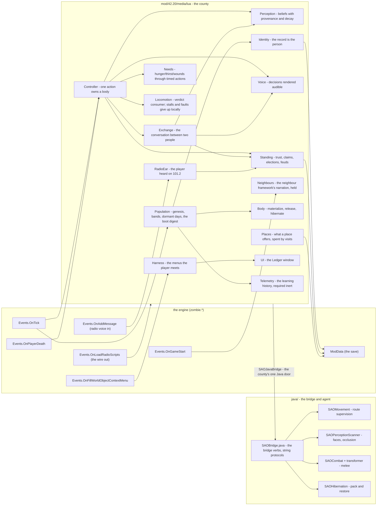
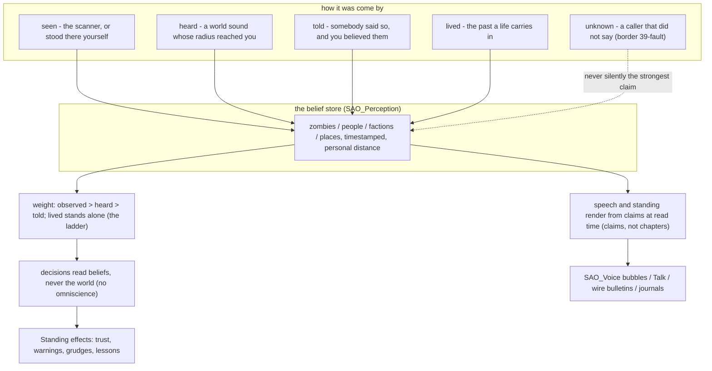
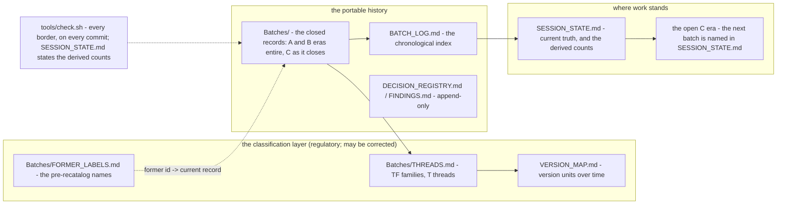

| Document | Survivor Awareness Overhaul Maps |
|---|---|
| Version | `4.2.3.0-pre-alpha` |
| Author | ellyj3rain |
| Repository | `MAPS.md` |
| Status | CANONICAL - the three pictures a human reads first: runtime, knowledge, catalog. |

# Maps

Three maps of the project as it is built. Every node names the file or the
rule that owns it. If a fact below disagrees with the tree, the tree is right
and this file is wrong - say so rather than repairing around it.

## Runtime - what talks to what

Two tick loops, one save story.

Rules these edges honor: Lua never iterates or indexes an engine object - the
bridge hands back verdict strings or opaque values
([`ARCHITECTURE.md`, the interop law](ARCHITECTURE.md)); one
action owns a body at a time ([`SAO_Controller.lua`](mod/42.20/media/lua/client/SAO_Controller.lua)
- DR-011); the save is Identity's records, Standing's store, and Places'
depletion rows ([DR-002, DR-005](DECISION_REGISTRY.md); [B39](Batches/)).

## Knowledge - how a fact is allowed to arrive

The laws: told never outranks observed ([A15, DR-007](Batches/)); every
acquisition says how, and `unknown` fails the gate ([B39, Border 28](Batches/));
memory of the dead does not decay ([F-033](FINDINGS.md)); speech is a
transport, never a pathway ([B27, the one-experience-loop law](Batches/)).

## Catalog - how to find the work

Rules: the ledgers are extended, never rewritten ([GOVERNANCE.md](GOVERNANCE.md));
indexes are regulatory and live one edit from the tree ([B52](Batches/));
raw history before the recatalog resolves only through
[FORMER_LABELS.md](Batches/FORMER_LABELS.md).
